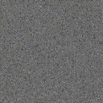

<meta charset="UTF-8">

## Summary

Code and data of the article:

> Random Auxetic Porous Materials from Parametric Growth Processes <br>
> Jonàs Martínez <br>
> Computer Aided Design (2021) <br>

* We introduce an algorithmically-defined growth process that is able to generate a random porous material with negative Poisson's ratio.
* The growth process involves randomly placed non-overlapping cells that grow according to a parameterized growth law.
* The growth process can be computed very efficiently and enables the generation of large-scale random auxetic materials in commodity computers.



## Data

The data from the article is at **data.tar.gz**

## Code

Tested on Ubuntu 20.04.2 LTS

### Prerequisites

* Anaconda Python 3 distribution (https://www.anaconda.com/)

Type on a terminal:
```
sudo apt-get install g++ cmake libcairo2-dev octave texlive-latex-extra dvipng cm-super python3-pip
conda install -c anaconda numpy pandas seaborn
conda install -c conda-forge scikit-optimize
pip3 install pdfCropMargins --user --upgrade
```

### Compilation

To compile type on a terminal:

```
cd code/
cmake -DCMAKE_BUILD_TYPE=Release .
```

```
make
```

If everything goes well, an executable file called **growthprocess2d** will be created in the folder **code/**

## Usage

The executable **growthprocess2d** has a command line parameter that specifies the path to the text file with the input parameters.
The input parameters file has a simple format, consisting of attribute-value pairs in each line, separated by the symbol '='
The following table gives a brief description of each attribute and the expected value.

| Attribute       | Value     | Description     |
| :------------- | :----------: | -----------: |
| *name*          | string | Path where the results (adding the extension, e.g., png, ppm, txt) are going to be saved |
| *point_process* | [Random, RSA] | Which point process is used: Poisson point process (Random) or Random Sequential Adsorption (RSA)   |
| *image_size*    | integer | Width and height of the porous material image | 
| *symmetry_type* | [NoSymmetry, RotationalSymmetry, ReflectionalSymmetry] | Symmetry imposed to the star-shaped set governing the growth process |
| *symmetry_degree* | integer | Degree of the symmetry of the star-shaped set (if any). For instance, a value of three and having RotationalSymmetry implies three-fold rotational symmetry | 
| *random_seed* | integer | Random seed for the growth process |
| *rsa_max_dist_rel_pixel* | float | If RSA point process is selected, this defines the maximum distance between two points of the point process | 
| *num_sites_per_pixel* | float | If a Poisson point process is selected, this defines the Poisson point process intensity |
| *radial_spans* | array of floats separated by comma | List of known values of the star-shaped set S (radial spans) | 
| *max_growth_length_radial_spans* | array of floats separated by comma | List of known values of the star-shaped set S* (radial spans) | 

The quantities *image_size*, *rsa_max_dist_rel_pixel*, *and num_sites_per_pixel* are relative to the size of a pixel, and a pixel has dimension 1x1.

For other parameters, please refer to the exemplar files in the folder named **code/parameters/**, and also have a look at the file **code/parameters.h**


## Script to generate the article results

A single script named **code/all.sh** is provided that generates most of the results and figures of the article.
This script must be executed from the folder **code/** with

```
./all.sh
```

and the resulting data will populate the folder **results/**


## Acknowledgements

This work was partly supported by ANR MuFFin ([ANR-17-CE10-0002](https://anr.fr/Project-ANR-17-CE10-0002)).

The 2D homogenization function from **code/homogenize_2d.m** was taken from the article

> [How to determine composite material properties using numerical homogenization](https://doi.org/10.1016/j.commatsci.2013.09.006) <br>
> Andreassen, E., & Andreasen, C. S.  <br>
> Computational Materials Science, 83, 488-495. (2014) <br>

The binary file in the folder **code/data/** is a large set of points (RSA point process) precomputed with [PDSample](https://github.com/ddunbar/PDSample)
